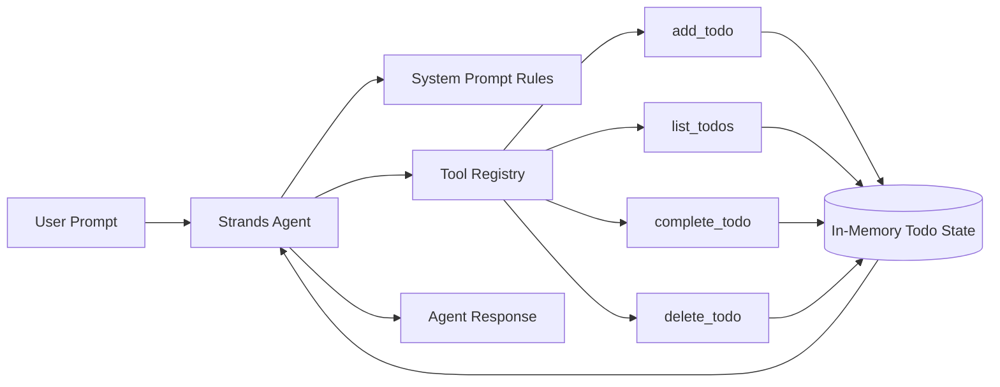
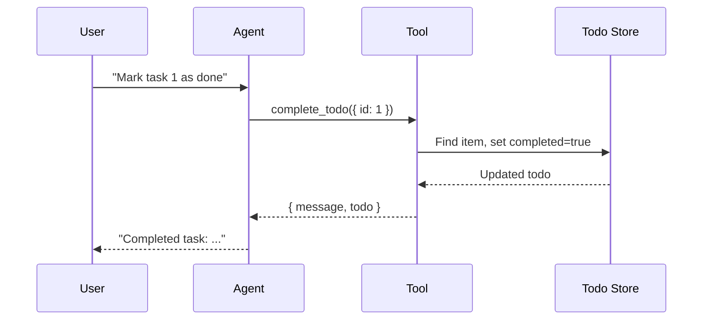

# AWS Strands To-Do Agent (TypeScript)

A practical starter app for learning the AWS Strands agent pattern using a simple to-do assistant.

This sample is based on the article:

- **AWS Strands for Builders: How I Used It to Explore My AWS Builder Competition MVP**
- Project context: **Cloud Clarity AI**

## What Is AWS Strands?

AWS Strands (Strands Agents) is an open-source, code-first SDK for building AI agents. The core mental model is:

- **Model**: the LLM that reasons about user requests
- **Prompt**: the behavior contract and operating rules
- **Tools**: explicit capabilities the model can call to do real work

Instead of hardcoding every workflow branch, you define safe tools and clear instructions, then let the model choose which tool to call.

## How This Sample Uses Strands

This app implements a tiny to-do assistant with four tools:

- `add_todo`
- `list_todos`
- `complete_todo`
- `delete_todo`

The agent does not mutate state directly. It decides what to do from natural-language prompts, then invokes the right tool. The tools own all state changes.

## Architecture

### Components and Responsibilities

- **CLI Runner (`src/index.ts`)**: Sends a sequence of prompts and prints agent responses.
- **Agent (`Agent`)**: Decision layer that chooses tool calls based on prompt + context.
- **Tool Registry**: Defines tool schemas, descriptions, and handlers.
- **State Store (`todos` array)**: In-memory data used by tool handlers.

### High-Level Diagram



### Request Lifecycle

1. User prompt is passed to the agent.
2. Agent interprets intent using system prompt rules.
3. Agent decides whether to call a tool.
4. Tool handler executes business logic and updates state.
5. Tool result returns to agent.
6. Agent returns final user-facing response.

### Sequence Diagram



## Prerequisites

- Node.js 20+
- npm 10+
- AWS account with model access required by Strands/Amazon Bedrock
- Local AWS credentials configured with AWS CLI

## Setup

```bash
npm install
```

Configure AWS locally (do not commit credentials):

```bash
aws configure
```

Optional local environment:

```bash
cp .env.example .env
```

## Run

```bash
npm run dev
```

You should see a sequence of prompts where the agent adds, lists, completes, and deletes tasks.

## Scripts

- `npm run dev` - Run the TypeScript sample directly
- `npm run typecheck` - Validate strict TypeScript types
- `npm run build` - Compile to `dist/`
- `npm run start` - Run compiled JavaScript
- `npm run scan-secrets` - Scan tracked files for common secret patterns

## Security Notes

- No AWS credentials are stored in this repository.
- Do not commit `.env` files, private keys, or tokens.
- Run `npm run scan-secrets` before pushing.

## From Demo to Production

This sample is intentionally small and uses in-memory state.

To productionize:

- Replace in-memory store with DynamoDB or Aurora
- Add authN/authZ and request validation
- Add observability (structured logs, traces, metrics)
- Add retries/timeouts and explicit error taxonomy
- Add integration tests around tool behavior and model interactions

## Cloud Clarity AI Connection

This repo demonstrates the same design pattern used while exploring **Cloud Clarity AI** ideas: agent + tools + prompt. The toy to-do example is deliberately simple so the architecture is easy to understand before applying it to cloud security workflows.

## Links

- Builder Center article: **https://builder.aws.com/content/3ACK4qkwuNBOnrzoujYIGuXHzvL/aideas-cloud-clarity-ai**
- GitHub repository: `https://github.com/sanjaynela/strands-todo-agent`
